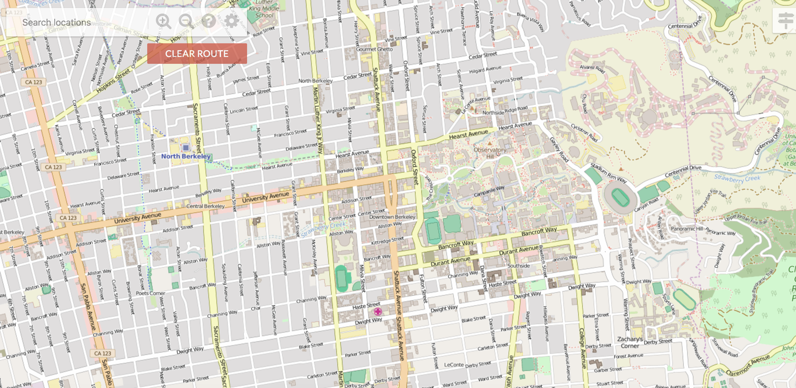
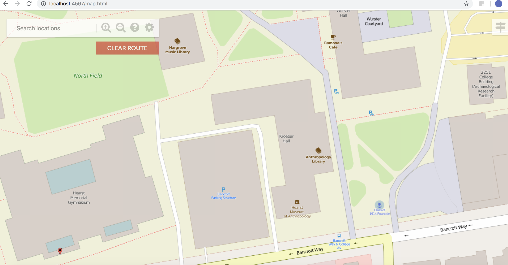
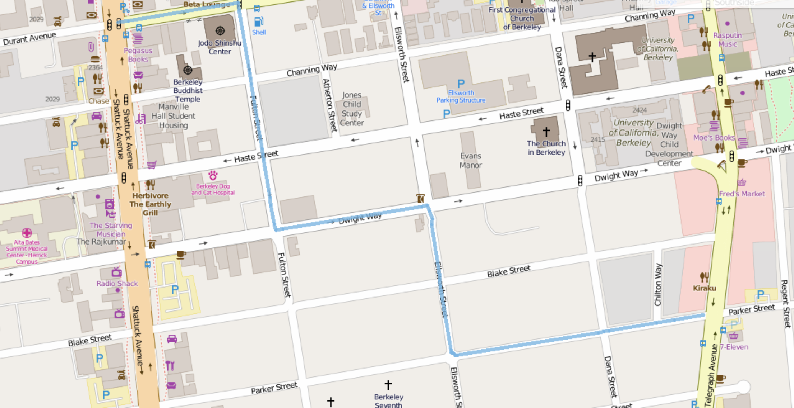
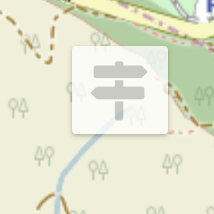
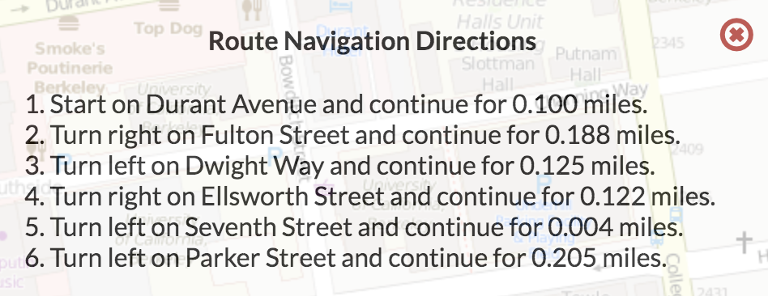
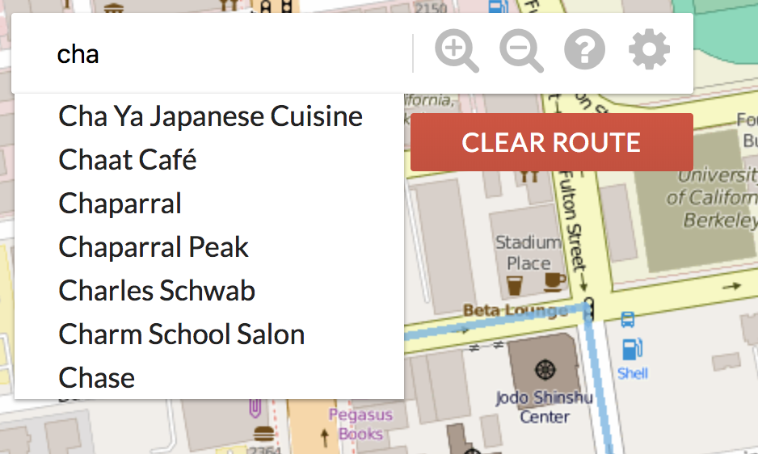
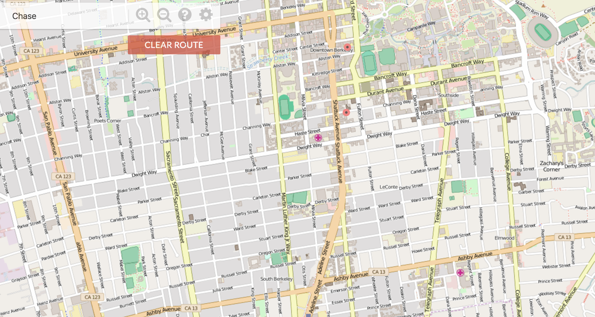

# Bear Maps

## [Live Site](http://lingjie-bearmaps.herokuapp.com/map.html)
Bear Maps is a web mapping application that can find routes, search position and navigate in Berkeley. This project is from the UC Berkeley's CS61b Data Structures course. I Implemented back end features including [Rasterer](https://github.com/XGuGu/cs61b/blob/master/proj3/src/main/java/Rasterer.java), [GraphDB](https://github.com/XGuGu/cs61b/blob/master/proj3/src/main/java/GraphDB.java), [GraphBuildingHandler](https://github.com/XGuGu/cs61b/blob/master/proj3/src/main/java/GraphBuildingHandler.java) and [Router](https://github.com/XGuGu/cs61b/blob/master/proj3/src/main/java/Router.java).

## Key Features and Technical Implementation

## Rasterer

Rasterer converts requested map information into pixel-by-pixel image , which allows user to have high resolution of image at different zoom level.




```java
public Map<String, Object> getMapRaster(Map<String, Double> params) {

      Map<String, Object> results = new HashMap<>();
      double lonDPP = (params.get("lrlon") - params.get("ullon")) / params.get("w");
      int depth = getDepth(lonDPP);

      results.put("depth", depth);
      double xStepCount = ROOT_WIDTH / Math.pow(2, depth);
      double yStepCount = ROOT_HEIGHT / Math.pow(2, depth);

      int[] xCounts = horizonCount(params.get("ullon"), params.get("lrlon"), xStepCount);
      int[] yCounts = verticalCount(params.get("ullat"), params.get("lrlat"), yStepCount);


      String[][] images = getImageFiles(depth, xCounts, yCounts);

      results.put("raster_ul_lon", MapServer.ROOT_ULLON + xCounts[0] * xStepCount);
      results.put("raster_lr_lon", MapServer.ROOT_ULLON + (1.0 + xCounts[1]) * xStepCount);
      results.put("raster_ul_lat", MapServer.ROOT_ULLAT - yCounts[0] * yStepCount);
      results.put("raster_lr_lat", MapServer.ROOT_ULLAT - (1.0 + yCounts[1]) * yStepCount);
      results.put("render_grid", images);

      if (params.get("ullon") > params.get("lrlon") || params.get("lrlat") > params.get("ullat") ||
              params.get("lrlon") <= MapServer.ROOT_ULLON || params.get("ullon") >= MapServer.ROOT_LRLON ||
              params.get("lrlat") >= MapServer.ROOT_ULLAT || params.get("ullat") <= MapServer.ROOT_LRLAT) {
          query_success = false;
      }
      results.put("query_success", query_success);

      return results;
  }
```

## GraphDB & GraphBuildingHandler

GraphDB is implemented for storing contents from Berkeley OSM. So that I can use the map data to build features like autocomplete and route search. GraphBuildingHandler is used by SAX parser to parse Nodes and Ways from the OSM(OpenStreetMap) file.


## Route Searching



The blue line represents the shortest path between two location given by the user. I used A star for the searching algorithm.

```java
private static void aStarSearch(PriorityQueue<Long> fringe, Set<Long> visited, Map<Long, Double> distanceTo,
                                    Map<Long, Long> edgeTo, GraphDB g, long endNode) {
        while (!fringe.isEmpty()) {
            long currentNode = fringe.poll();
            if (currentNode == endNode) {
                break;
            }

            if (visited.contains(currentNode)) {
                continue;
            }

            visited.add(currentNode);
            for (long neighbor : g.adjacent(currentNode)) {
                double distance = distanceTo.get(currentNode) + g.distance(currentNode, neighbor);
                if (distance < distanceTo.get(neighbor)) {
                    distanceTo.put(neighbor, distance);
                    edgeTo.put(neighbor, currentNode);
                    fringe.add(neighbor);
                }
            }
        }

    }
```

## Navigation



After user search a route. A list of navigation information is also given by the Router class.

## Search Bar




The search bar supports prefix. The space and time complexity is improved by using Trie. The red spots on the map represent the locations of the place found.

```java
public List<String> getLocationsByPrefix(String prefix) {
        List<String> locationNameList = new LinkedList<>();

        String cleaned = cleanString(prefix);
        for (String key : st.keysWithPrefix(cleaned)) {
            Long id = wayNames.get(key).get(0);
            String fullName = getWayName(id);
            locationNameList.add(fullName);
        }

        return locationNameList;
    }
```

```java
public static List<Map<String, Object>> getLocations(String locationName) {
        List<Map<String, Object>> locationList = new LinkedList<>();

        List<Long> nodes = graph.getLocations(locationName);
        for (long id : nodes) {
            Map<String, Object> node = new HashMap<>();
            node.put("name", locationName);
            node.put("id", id);
            node.put("lat", graph.locationLat(id));
            node.put("lon", graph.locationLon(id));

            locationList.add(node);
        }

        return locationList;

    }
```
